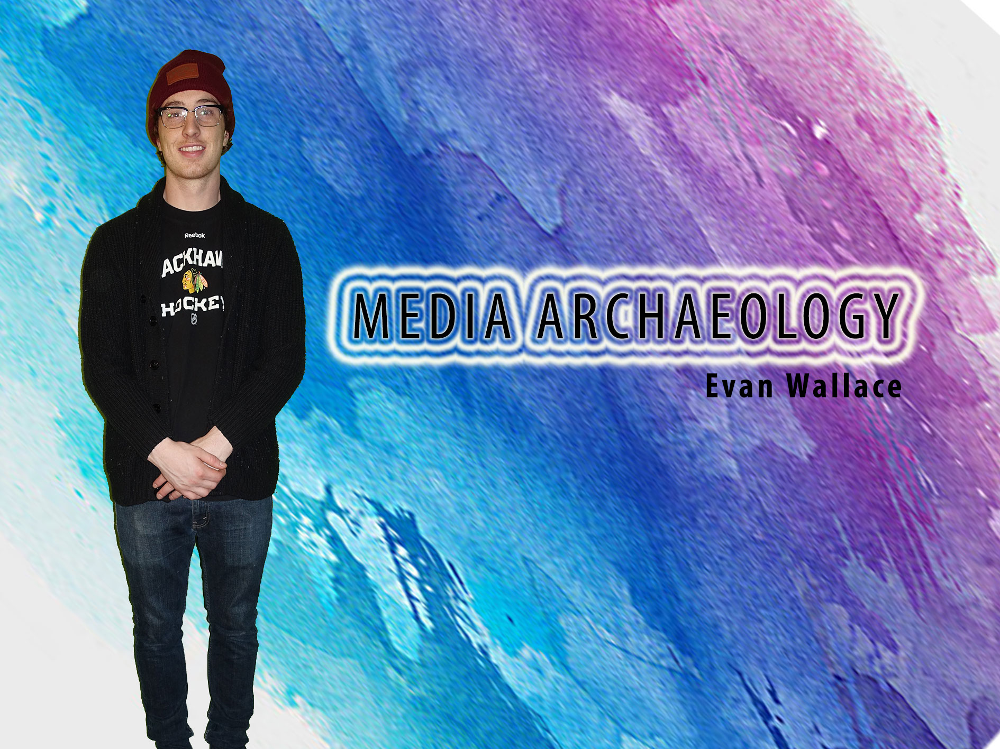
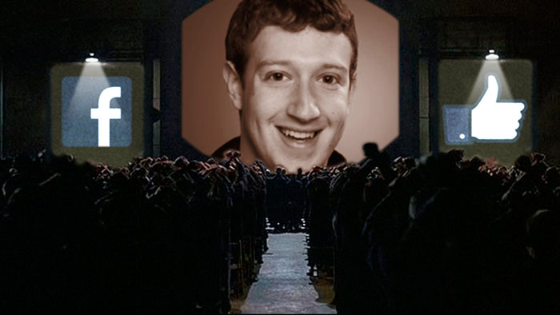

## Biography

  I am a second year student in the Interactive Arts and Science program found at Brock University. My research area is media archaeology and my research program involves challenging ideas of emerging technologies through reflection of past technological influences and effectively referencing academic material to maintain accuracy throughout projects. This research focus is reflected in my projects within this portfolio, such as my featured academic presentation on Surveillance. It is done in pecha kucha format, and looks at critically at current day surviellance issues within our everday lives. Similarly, my collaborative project looks at how we can create massive personal reference libraries to keep an accurate academic database of references to ensure accuracy when formulating conclusions surrounding emerging technoligies. I'd like to continue with media archaeology in the future through tehcnological outlets like interface design and production, and analyse trends found in their respective fields to help push the future of their industries.

## Featured Project: Academic Presentation

[Surveillance: A Present Day Perspective](https://ew12gb.github.io/IASC-2P02/reveal.js-Edited/):
  
 This presentation aims to look at the idiosyncratic technology found within George Orwell’s novel, “1984”. This book has found new relevance in recent years due to its strong themes of surveillance, as well as, its lack of transparency found among those with opposing ideologies within their dystopia. Utilizing media archaeology, this presentation aims to prove that these hypothetical technologies found within this work of fiction can be related to real services being actively used in today’s world, amongst millions of people across the globe. The mediums of which these relevant themes are expressed in present day culture do not physically reflect the ideas of George Orwell, but their underlying methods of surveillance and user complacency lend itself to a critical perspective on the truths surrounding todays massive social media companies and their technologies. It is to be presented in traditional pecha kucha format, and thus follows a 20 second per slide pacing at a complete 6 minutes 40 seconds. This presentation proves that the social media company “Facebook” partners with parent companies like “Cambridge Analytica” to utilize surveillance. This is done through profile creation that supresses the technological freedom of individuals, the active participation of political influence, and marketing campaigns that bolster capitalistic practices and ideologies.

My research on surveillance was a process to engineer from the beginning. I have read books which use technologies in many different ways, but 1984 stood out to me due to its horrible themes of a totalitarian regime. I felt my presentation lends itself to my interests in Media Archaeology, and I wanted to create a more professional and concrete presentation. Through the process of presenting within a Pecha Kucha format, I realized that some important information could not be conveyed in a timely manner. Some information did not have enough time, whilst other information could have been implemented for a more complete argument. I started by splitting two slides into four separate entities (https://github.com/ew12gb/IASC-2P02/commit/b028e7d3c51ac013ab9c68198c01b332481d5ca3) , allowing me to better express each individual technology used in the novel 1984. I also took the bullet points away from this section, and moved them to the speakers notes, showing that I understand what may actually be important from a visual aspect in a presentation scenario. I added a slide to preface how Facebook is a company that gathers information like a totalitarian government, however functions like a corporation. This lets me plant a seed in the audiences head before explaining how each of the four upcoming examples I am to give directly relate to the four examples previously expressed as being presented in Orwell’s fictional world (https://github.com/ew12gb/IASC-2P02/commit/7ac6c223b8c18c4d0d81a58a9367b69564dc8a99). And lastly, I felt it important to add a slide which ties the presentation together, adding information that gives insight into how the company is holding up on both a user and business standpoint (https://github.com/ew12gb/IASC-2P02/commit/288dda2a063a75529b310c68c5012252b81561bf). Overall, these changes have allowed me to create a more concrete presentation through more spaced out talking points, create a more engaging presentation through the use of well-timed and informative information, and gave me the opportunity to create some perspective, through the addition of information regarding the aftermath of Facebooks surveillance scandal.

## Collaborative Project

This was a collaborative project and presentation I had the pleasure of working on with four of my peers from Brocks Interactive Arts and Science program at Brock University. We aimed to critically look at the open sourced program “Zotero”, and analyse its intended use within the digital humanities. I was tasked with researching the team that keeps Zotero functioning, where it is being housed, and how the company manages to stay funded. With the combined efforts of everyone working on this collaborative project, we were able to situate the program firmly as a digital repository. 

Here is mmy 250 word collaboration statement. Incorporate and image, commit, and either. I approach collaboration in X ways, which is reflected in Y work (available [here](URL))

I also approach collaboration in A ways, which is reflected in B (Available [here](URL)).

I also contributed X assets to my team, seen below. 

## Academic Blog

As I started this project... [continue reading](blog)

## Initial Draft: Academic Presentation

[Original Presentation](https://ew12gb.github.io/IASC-2P02/reveal.js-master/)
