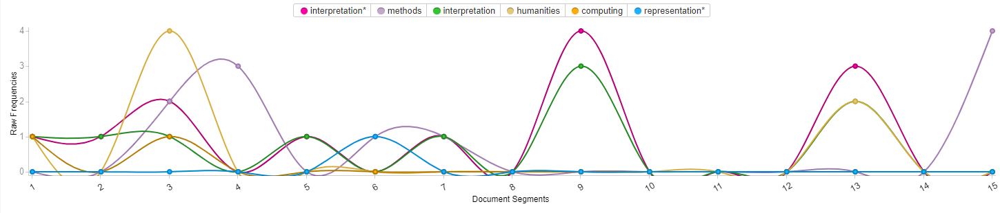
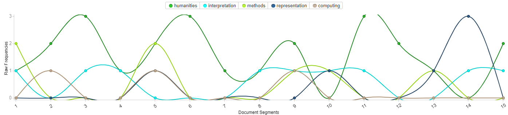
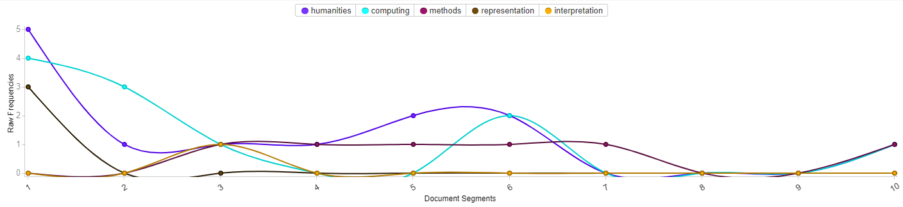

# Visual Representation
As I started this project, I aimed to take a closer look at Stephen Ramsay’s reading An Algorithmic Criticism from the book Reading Machines: An Algortihmic Criticism. This article is compelling due to its critical take on the field I have chosen to study: The Digital Humanities. Being faced with the challenge of critically reflecting on Ramsay’s paper, I sought after another reading from IASC 2P02’s repository of academic papers and journals that could give insight into Alvarado’s message. I chose to use Rafael Alvarado’s reading The Digital Humanities Situation. I feel this is fitting, as it looks at how the digital humanities can be understood within the field of academia. Lastly, I pulled an article from the website www.digitalhumanities.org/dhq. The article chosen was written by scholar Marinella Testori and is titled: “Methods of quality, quality of methods. What does Roberto Busa have to communicate to digital humanists in the 21st century? From hermeneutics to performativity”, discussing the foundation of the Digital Humanities and its goals to showcase how humanities computing works to effectively turn information into representation.

To start, I opened three individual voyant tool corpuses to actively visualize all three papers at once. This gave me the opportunity to critique the word clouds of each paper and look for similarities, as well as differences, between each of my bodies of text. As all the readings were based around the concept of Digital Humanities, it was easy to find similarities between each paper regarding common usage of language.
## Figure 1

## Figure 2

## Figure 3

Having immediate knowledge of Ramsay’s points represented in the first chapter of his book, I could use the word cloud feature to find critical words that helped support Ramsay’s claims of digital representation in humanities computing. I then wanted to use the Trends method of representation to showcase my findings in line graph fashion. The five words chosen to represent each article are: computing, methods, humanities, representation, and interpretation. My constraints for the bar graph were: 15 segments, with the frequencies set to raw frequencies. 

Ramsay’s main point is to understand the value and potential of the Digital Humanities field within academia. Ramsay writes of a place where Digital Humanities can bolster academic information through the digitization of information within given parameters, however, can be lost in translation through the process of interpretation (Ramsay, 2011). Understanding this concept allowed me to better realize the importance of the words I chose to analyze through these texts. 

Ramsay’s line graph (Figure 1) early on showcases how he is specifically talking about the humanities as his subject in the early portions of his reading. Early on he seems to stress about the importance of interpretation, and uses this word regularly over the similar word representation. Interpretation is the focus of this body of text and holds strong weight throughout, represented by the green and pink lines. It is clear that Ramsay has an understanding of the methods behind interpretation, and can be visually noticed through the weaving between words like interpretation or representation, and methods. Computing is the main process of data visualization within Digital Computing, and is fittingly prominent in both the beginning and end of this reading, as one cannot talk about digital data representation without a small preface on computing.

Alvarado’s line chart (Figure 2) dictates itself in a similar fashion to that of Ramsay’s. His chart has similar traits to Ramsay’s with regards to interpretation and methodology. He is often describing digital humanities and computing as a subject of visual interpretation or representation of data and often follows up immediately with text regarding how or why a form of representation is being used. His paper, however, is more of a critique of Digital Humanists functionality in academia. Alvarado still has inflection on the purpose of methodology, and thinks that Digital Humanists should be more critical of their tools, unlike other facets of academia like medicine (Alvarado, 2012). Unlike Ramsay’s text, Alvarado utilizes the word representation to bundle his thoughts about methodology and interpretation into a more concrete dialogue between the two words in the latter half of his text. Lastly, humanities are a running theme throughout the text, as it is the focus of the overarching paper.

Testori’s line chart has a similar analysis of methodology and representation being the main points dictated in this paper regarding the Digital Humanities. Her paper had a strong emphasis on humanities, computing, and representation. This is clearly indicated through the beginning formations of her papers specific line graph (Figure 3). Her graph was not as much about interpretation of data, like Ramsay’s critiques of the Digital Humanities, and focused more on the methodology of the physical practices of representation. This is clearly shown in this graph through the constant line of red which indicates the frequencies of the word method found throughout her paper. The only variable that stands out as fluctuating is computing, much like Ramsay’s text. This is understandable, as it is hard to understand digital representation without an understanding of computation.

Through this visualization, it is clear that methodology is the main focus when understanding data visualization within the Digital Humanities. As scholars who aim to showcase information through representation, we have to be careful of the parameters we use as a guide for understanding. What we as Digital Humanists think may best represent a given database of information effectively, may end up being misrepresented through the readers understanding of how this information should be interpreted.  
